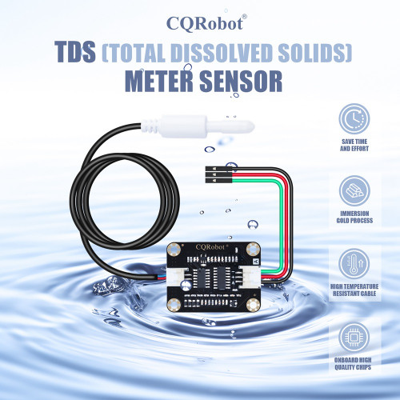
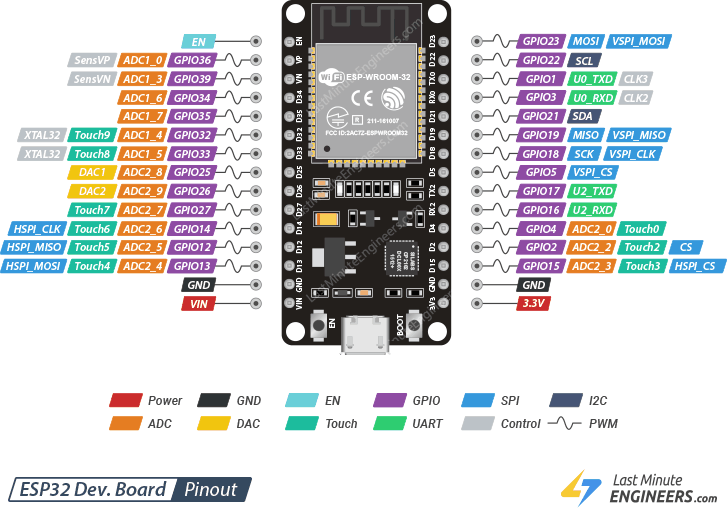
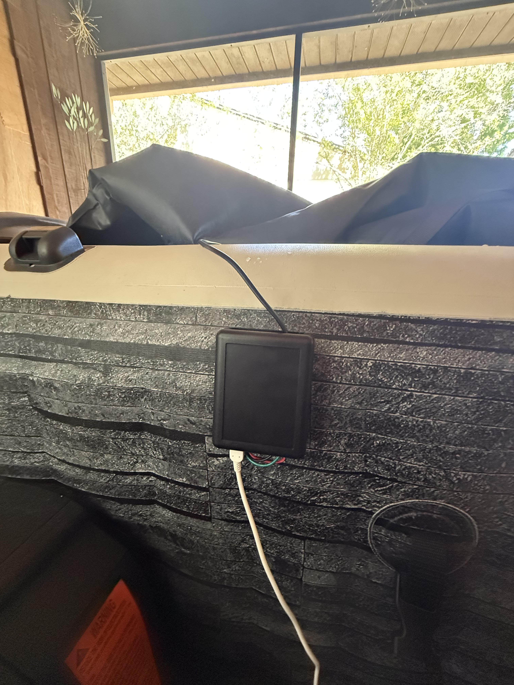
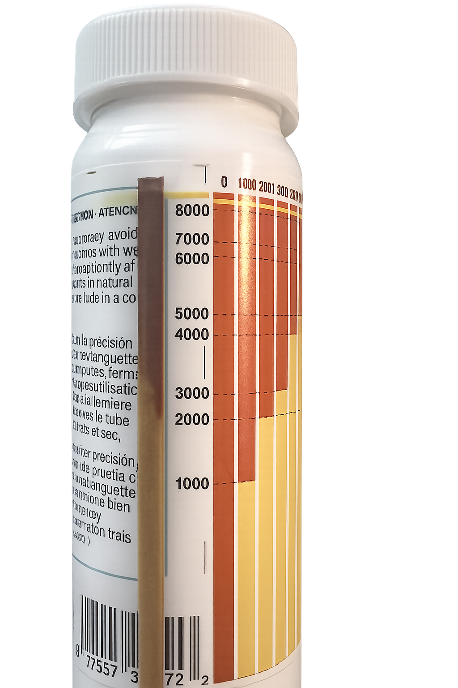
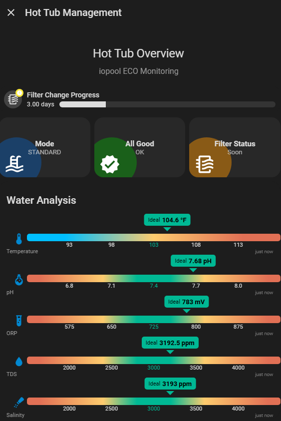

# 🧪 ESPHome Saltwater Hot Tub Monitor (TDS → Salinity)

A simple, **real-world calibrated** system for monitoring salt levels in a hot tub using an ESP32 + analog TDS probe.

---

# 📌 Overview

This project uses:

- ESP32 (WROOM-32)
- CQRobot / DFRobot TDS probe (analog)
- ESPHome
- Home Assistant

To measure:

- **TDS (ppm)** → calibrated to match real salt levels  
- **Salinity (ppm)** → derived directly from calibrated TDS  

---

# 🧠 Key Concept

❌ Generic formulas are unreliable  
✅ Calibration against a real salt test = accurate results  

---

# 🔬 CQRobot TDS Sensor



This project uses a **CQRobot analog TDS (Total Dissolved Solids) sensor**, which measures water conductivity and outputs an analog voltage.

### 🧠 How it works

- The probe measures **electrical conductivity** of the water  
- Higher salt concentration → higher conductivity → higher voltage  
- ESP32 reads this voltage and converts it into **ppm**

---

### ⚠️ Important Notes

- This sensor **does NOT directly measure salt**
- It measures **all dissolved solids (TDS)**
- In saltwater hot tubs:
  - Most dissolved solids = salt  
  - So **TDS ≈ salinity after calibration**

---

### ❗ Why calibration is required

Out of the box, the sensor:

- Uses a generic formula (often inaccurate)
- Varies between probes and setups

👉 This project fixes that by:

- Matching readings to a **real test strip**
- Applying a custom **scale factor**

---

### 🔧 Output Behavior

- Analog voltage range: ~0–3.3V  
- Sensitive to:
  - temperature  
  - probe placement  
  - water movement  

---

### 💡 Best Practices

- Keep probe submerged at all times  
- Avoid air bubbles (jets can cause noise)  
- Do not touch probe while measuring  
- Rinse probe with clean water occasionally  

---

# ⚙️ ESPHome Configuration

```yaml
sensor:
  - platform: adc
    pin: GPIO34
    id: tds_voltage
    name: "TDS Voltage"
    update_interval: 5s
    attenuation: 12db
    filters:
      - sliding_window_moving_average:
          window_size: 10
          send_every: 5
      - multiply: 3.3

  - platform: template
    name: "TDS ppm"
    unit_of_measurement: "ppm"
    update_interval: 5s
    lambda: |-
      float voltage = id(tds_voltage).state;

      // Calibration factor (tune this)
      float scale = 410.0;

      float tds = voltage * scale;

      return tds;
```

---

# 🔧 Hardware

## 🖥️ ESP32 WROOM Pin Layout



### Pins Used

- GPIO34 → Analog input (TDS signal)
- 3.3V → Sensor power
- GND → Ground

⚠️ GPIO34 is input-only and cannot be used as an output.

---

## 🔌 Wiring

| Probe Wire | ESP32 Pin |
|-----------|----------|
| Red       | 3.3V     |
| Black     | GND      |
| Green     | GPIO34   |

---

# 📸 Setup

## 🧪 Physical Setup



### Notes

- Keep the probe submerged in circulating water  
- Avoid placing directly in front of jets (bubbles cause noise)  
- Ensure solid wiring connections  

---

## 🧂 Test Strip Calibration



Calibration is done by matching the sensor reading to the test strip result.

---

## 📊 Home Assistant Dashboard

